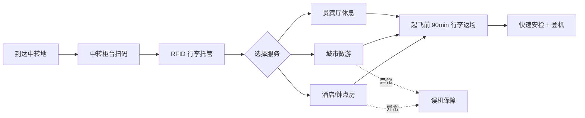
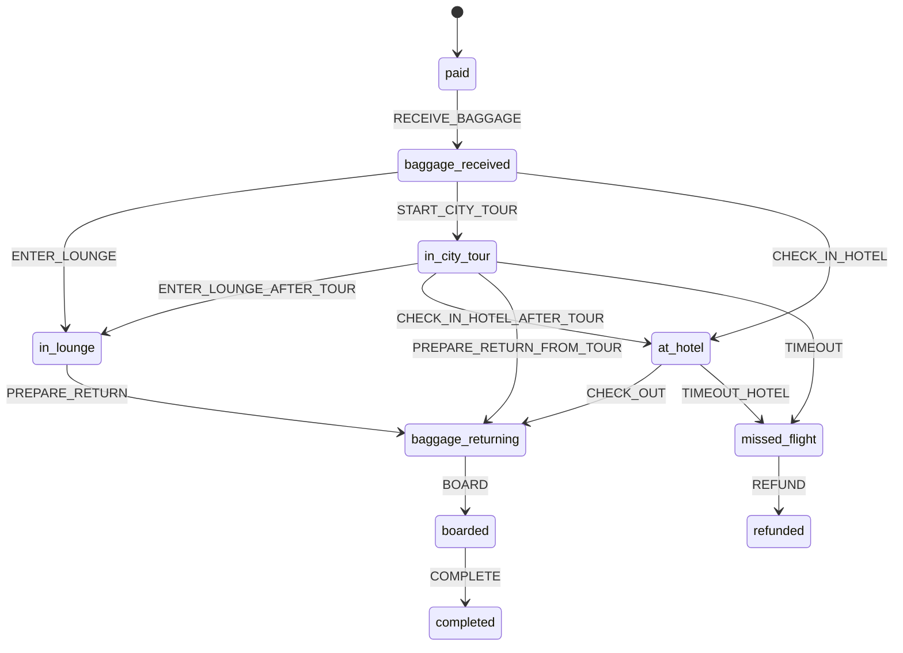
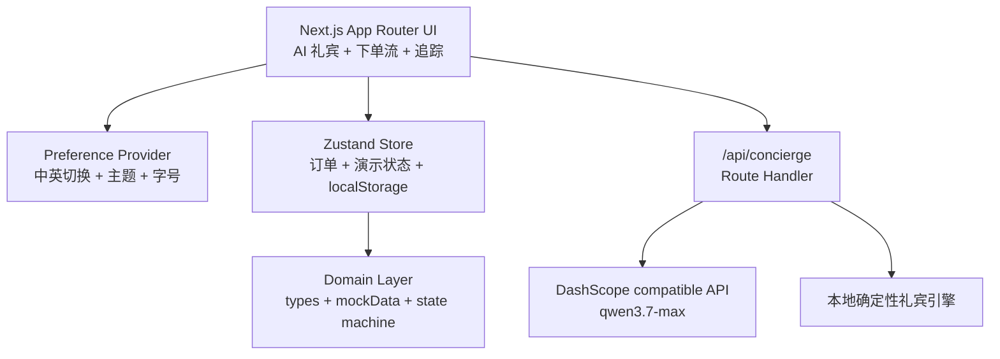
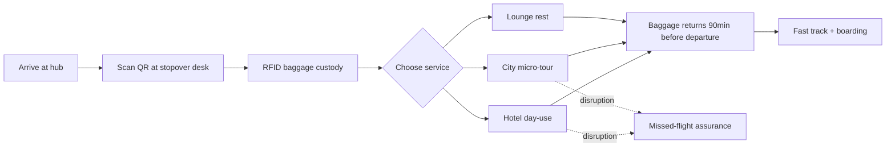
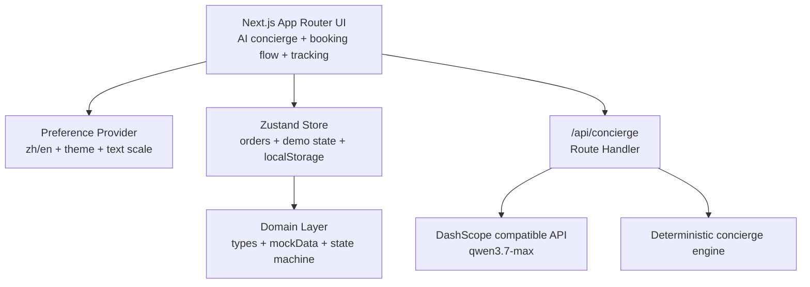

# 龙腾中转礼遇 Stopover Web Demo

<a id="top"></a>

<div align="center">
  
  <br />
  <br />
  <a href="#中文版本"></a>
  &nbsp;&nbsp;
  <a href="#english-version"></a>
  <br />
  <sub>GitHub README-safe HTML: image buttons jump to the selected language section.</sub>
</div>

---

## 中文版本

### 1. 项目定位

`mystopover` 是一个面向 hackathon / 产品评审的中转服务 Web 演示原型。它用 AI 礼宾、套餐匹配、RFID 行李托管和误机保障，把 **6-48 小时中转等待** 转化为可购买、可履约、可追踪的轻量目的地体验。

> 用户不是买一次观光，而是在买确定性：行李有人管、时间有人算、出机场有人带、误机有人兜底。

- 当前版本：**v0.1.0**
- 产品主张：**休息室信任锚 + 行李全托管 + 模块化城市服务**
- 核心用户：探索型商旅、家庭中转、红眼/长途中转休息人群
- MVP 范围：C 端体验和履约逻辑 demo，不是生产级订单中台

### 2. Hackathon 5 分钟演示流


| 步骤 | 页面 | 演示重点 |
| --- | --- | --- |
| 1 | `/` | AI 礼宾理解“新加坡中转 10 小时，有 1 件行李，想轻松看城市但不能误机” |
| 2 | `/search` | 选择枢纽、航班、总中转时长和可服务时间窗口 |
| 3 | `/packages` | 推荐“微游包”，解释中转时长、行李托管、返场缓冲和增值项 |
| 4 | `/checkout -> /order` | 模拟支付，生成 QR 电子凭证和 RFID 行李标签 |
| 5 | `/journey` | 快进状态机，展示行李返场、城市微游和误机保障 |

### 3. 三档套餐


| 套餐 | 适合时长 | 核心权益 | Demo 角色 |
| --- | --- | --- | --- |
| 轻享包 | 6-8h | 贵宾厅 3h、行李寄存、快速安检、淋浴/Wi-Fi | 短中转补能 |
| 微游包 | 10-18h | 行李全托管、城市 4-6h 微游、接送、误机保障 | 主推荐链路 |
| 过夜包 | 12-36h | 酒店/钟点房、行李直送、机场酒店接送、误机保障 | 跨夜/家庭中转 |

增值项包括中转地 eSIM、专车接送、酒店钟点房续住、淋浴、机场餐饮券、AI 停留团餐匹配和私人包车。

### 4. 当前已实现

- AI 礼宾首页：自然语言输入中转时长、机场、行李与偏好，输出套餐、路线、增值项和履约建议。
- 服务端礼宾接口：`/api/concierge` 调用 DashScope OpenAI-compatible `qwen3.7-max`，无 Key 或失败时降级为本地确定性规则。
- 5 步下单流：`/search -> /packages -> /checkout -> /order -> /journey`。
- PRD 阈值对齐：最低起订 6h；轻享 6-8h、微游 10-18h、过夜 12-36h；4h 样例作为不可订购边界。
- 订单状态机：覆盖支付、收包、休息室、微游、酒店、返场、登机、完成、误机、退款。
- RFID 行李追踪：按航班到达/起飞时间生成相对时间线。
- 电子凭证：订单页生成 QR 码，展示旅客、航班、套餐、增值项和履约说明。
- 演示控制台：快速推进状态、触发行李流转和误机保障分支。
- 全局偏好层：支持中文/英文、亮色/暗色、文字尺度切换，并持久化到 `localStorage`。

### 5. 旅行动线



### 6. 履约状态机



状态变化会同步更新行李位置、行李状态、城市游状态和演示日志。关键行李节点按航班相对时间计算，例如到达后约 20 分钟收包，起飞前约 90 分钟返场，起飞前约 60 分钟签收登机。

### 7. 技术架构



| 层级 | 当前实现 |
| --- | --- |
| 应用框架 | Next.js 16.2.9，App Router |
| UI 运行时 | React 19.2.4 |
| 语言 | TypeScript 5 |
| 样式 | Tailwind CSS v4，`@tailwindcss/postcss` |
| 状态 | Zustand 5 + `persist` |
| 时间 | Day.js |
| 动效 | Framer Motion |
| 图表 | Recharts |
| QR 码 | qrcode.react |
| 图标 | lucide-react |
| AI 礼宾 | Next.js Route Handler + DashScope OpenAI-compatible API |

### 8. 代码结构

```text
src/
  app/
    layout.tsx              全局布局、App Chrome、Provider
    page.tsx                AI 礼宾首页
    pitch/page.tsx          Hackathon 展示页
    api/concierge/route.ts  Qwen 礼宾接口与本地兜底
    (flow)/
      search/page.tsx       航班与中转时长选择
      packages/page.tsx     套餐匹配与增值项选择
      checkout/page.tsx     履约核验与模拟支付
      order/page.tsx        电子凭证与订单状态
      journey/page.tsx      行李/行程追踪与保障演示
  components/features/
    StopoverDashboard.tsx
    MobileConciergeAgent.tsx
    DemoController.tsx
    AppPreferenceProvider.tsx
    PreferenceToolbar.tsx
  lib/
    types.ts
    mockData.ts
    conciergeEngine.ts
    conciergePersonas.ts
    appPreferences.ts
    state-machine/orderState.ts
    store/orderStore.ts
```

### 9. 本地运行

```bash
npm install
npm run dev
```

打开：

```text
http://localhost:3000
```

常用命令：

```bash
npm run dev      # 启动开发服务器
npm run build    # 生产构建与 TypeScript 校验
npm run start    # 启动生产构建产物
npm run lint     # ESLint
```

### 10. AI 礼宾配置

`/api/concierge` 默认使用阿里云 DashScope OpenAI-compatible endpoint。未配置 Key、接口失败或超时时，会返回本地规则引擎结果，保证现场 demo 不会中断。

```bash
DASHSCOPE_API_KEY=...
COMPATIBLE_API_KEY=... # 可作为 DASHSCOPE_API_KEY 的替代
COMPATIBLE_BASE_URL=https://dashscope.aliyuncs.com/compatible-mode/v1
DEFAULT_MODEL=qwen3.7-max
MODEL_TEMPERATURE=0.2
LLM_CALL_TIMEOUT=10
```

使用现有 smartbundlex 百炼配置：

```bash
set -a
source /Users/kaisun/smartbundlex/.env.dev
set +a
npm run dev -- -p 3000
```

### 11. 部署说明

当前版本包含 `/api/concierge` 服务端接口，建议部署到支持 Next serverful 运行时的平台，例如 Vercel、Node Server 或支持 Next Route Handler 的云平台。不建议直接做纯静态导出。

`next.config.ts` 当前设置：

- `images.unoptimized = true`：便于 demo 使用远程图片，不依赖图片优化服务。
- `allowedDevOrigins = ['192.168.70.6']`：便于局域网现场访问开发服务器。
- `devIndicators = false`：减少现场演示干扰。

### 12. 非目标和限制

- 不接真实支付、航班动态、行李 IoT/RFID、酒店 PMS、eSIM、餐饮或城市游供应商库存。
- 不做用户登录、B2B 分销、签证/入境服务或后台运营系统。
- 这是 C 端体验和履约逻辑 demo，不是生产级订单中台。
- i18n 已覆盖主要界面，但部分长运营文案仍可继续结构化。

### 13. 验收清单

- `/search -> /packages -> /checkout -> /order -> /journey` 可以完整跑通。
- 4h 中转不可订购；6-8h、10-18h、12-36h 分别推荐对应套餐。
- 刷新页面后订单不丢失。
- 行李时间线至少展示收件、保管/转运、返场、签收节点。
- 演示控制台可以推进正常履约和误机保障分支。
- 中文/英文、亮色/暗色、文字尺度切换可用并持久化。
- `npm run build` 通过。

<div align="center">
  <a href="#top">回到顶部</a>
  ·
  <a href="#english-version"></a>
</div>

---

## English Version

### 1. Product Positioning

`mystopover` is a hackathon / product-review web demo for stopover services. It combines AI concierge, package matching, RFID baggage custody and missed-flight assurance to turn a **6-48h airport layover** into a purchasable, trackable mini-destination experience.


> Users are not buying sightseeing; they are buying certainty across baggage, timing, route guidance and disruption protection.

- Current version: **v0.1.0**
- Product thesis: **lounge as trust anchor + baggage custody + modular city services**
- Core users: exploratory business travelers, families and red-eye recovery passengers
- MVP scope: consumer experience and fulfillment-logic demo, not a production order platform

### 2. 5-Minute Hackathon Demo Flow


| Step | Page | Demo Focus |
| --- | --- | --- |
| 1 | `/` | The AI concierge understands “10h stopover in Singapore, one bag, light city visit, no missed-flight risk.” |
| 2 | `/search` | Select hub airport, flights, total layover and service window. |
| 3 | `/packages` | Recommend the micro-tour package and explain baggage custody, return buffer and add-ons. |
| 4 | `/checkout -> /order` | Simulate checkout and generate QR voucher plus RFID baggage tag. |
| 5 | `/journey` | Fast-forward the state machine to show baggage return, city micro-tour and disruption assurance. |

### 3. Package Matrix

| Package | Duration | Core Benefits | Demo Role |
| --- | --- | --- | --- |
| Light Rest | 6-8h | 3h lounge, baggage storage, fast-track security, shower/Wi-Fi | Short layover recovery |
| City Micro-tour | 10-18h | RFID baggage custody, 4-6h city route, transfer, missed-flight protection | Main demo path |
| Overnight | 12-36h | Hotel/day-use room, baggage delivery, airport-hotel transfer, assurance | Overnight/family layover |

Add-ons include eSIM, private transfer, hotel day-use extension, shower, airport meal voucher, AI group-meal matching and private car tour.

### 4. What Is Implemented

- AI concierge landing page: accepts natural-language layover time, airport, baggage and preference inputs, then returns package, route, add-on and fulfillment recommendations.
- Server-side concierge API: `/api/concierge` calls DashScope OpenAI-compatible `qwen3.7-max`, with deterministic local fallback when no key is configured or model calls fail.
- Five-step booking flow: `/search -> /packages -> /checkout -> /order -> /journey`.
- PRD-aligned thresholds: 6h minimum; Light 6-8h, Micro-tour 10-18h, Overnight 12-36h; 4h is a non-bookable boundary case.
- Order state machine: paid, baggage received, lounge, city tour, hotel, baggage return, boarded, completed, missed flight and refunded.
- RFID baggage tracking: timeline is derived from flight arrival/departure times.
- QR voucher: order page shows passenger, flight, package, add-ons and fulfillment details.
- Demo controller: fast-forwards states, baggage flow and missed-flight assurance branch.
- Global preferences: Chinese/English, light/dark theme and text scale persisted in `localStorage`.

### 5. Passenger Journey



### 6. Fulfillment State Machine


State transitions update baggage location, baggage status, tour status and demo logs. Key baggage timestamps are relative to flight times, such as baggage handoff around arrival +20min, return around departure -90min and boarding around departure -60min.

### 7. Technical Architecture



| Layer | Implementation |
| --- | --- |
| Framework | Next.js 16.2.9, App Router |
| UI Runtime | React 19.2.4 |
| Language | TypeScript 5 |
| Styling | Tailwind CSS v4, `@tailwindcss/postcss` |
| State | Zustand 5 + `persist` |
| Time | Day.js |
| Motion | Framer Motion |
| Charts | Recharts |
| QR Code | qrcode.react |
| Icons | lucide-react |
| AI Concierge | Next.js Route Handler + DashScope OpenAI-compatible API |

### 8. Code Map

```text
src/
  app/
    layout.tsx              Global layout, app chrome, providers
    page.tsx                AI concierge landing page
    pitch/page.tsx          Hackathon pitch page
    api/concierge/route.ts  Qwen concierge API + deterministic fallback
    (flow)/
      search/page.tsx       Flight and layover selection
      packages/page.tsx     Package matching and add-ons
      checkout/page.tsx     Fulfillment check and simulated payment
      order/page.tsx        QR voucher and order state
      journey/page.tsx      Baggage/tour tracking and assurance demo
  components/features/
    StopoverDashboard.tsx
    MobileConciergeAgent.tsx
    DemoController.tsx
    AppPreferenceProvider.tsx
    PreferenceToolbar.tsx
  lib/
    types.ts
    mockData.ts
    conciergeEngine.ts
    conciergePersonas.ts
    appPreferences.ts
    state-machine/orderState.ts
    store/orderStore.ts
```

### 9. Local Development

```bash
npm install
npm run dev
```

Open:

```text
http://localhost:3000
```

Useful commands:

```bash
npm run dev      # Development server
npm run build    # Production build + TypeScript checks
npm run start    # Run production build
npm run lint     # ESLint
```

### 10. AI Concierge Config

`/api/concierge` defaults to Alibaba Cloud DashScope OpenAI-compatible endpoint. Without a key, or when the model call fails/times out, it falls back to deterministic local rules so the demo remains presentable.

```bash
DASHSCOPE_API_KEY=...
COMPATIBLE_API_KEY=... # Alternative to DASHSCOPE_API_KEY
COMPATIBLE_BASE_URL=https://dashscope.aliyuncs.com/compatible-mode/v1
DEFAULT_MODEL=qwen3.7-max
MODEL_TEMPERATURE=0.2
LLM_CALL_TIMEOUT=10
```

Start with existing smartbundlex DashScope env:

```bash
set -a
source /Users/kaisun/smartbundlex/.env.dev
set +a
npm run dev -- -p 3000
```

### 11. Deployment Notes

This version includes the server-side `/api/concierge` route, so deploy it to a Next serverful runtime such as Vercel, a Node server or a cloud platform supporting Route Handlers. Pure static export is not recommended.

Current `next.config.ts` settings:

- `images.unoptimized = true`: allows remote demo images without image optimization service.
- `allowedDevOrigins = ['192.168.70.6']`: enables local-network demo access.
- `devIndicators = false`: keeps the live demo visually clean.

### 12. Non-Goals and Limits

- No real payment, live flight data, baggage IoT/RFID system, hotel PMS, eSIM, restaurant or city-tour inventory integration.
- No login, B2B distribution, visa/immigration service or admin console in this demo.
- This is a consumer experience and fulfillment-logic demo, not a production order platform.
- Core UI i18n exists, while some long-form operational copy can still be moved into structured dictionaries.

### 13. Demo Acceptance Checklist

- `/search -> /packages -> /checkout -> /order -> /journey` works end to end.
- 4h is non-bookable; package recommendations align with 6-8h, 10-18h and 12-36h windows.
- The order survives page refresh via local persistence.
- Baggage timeline shows handoff, custody/transit, return and delivery.
- Demo controller can drive both normal fulfillment and missed-flight assurance.
- Language, theme and text-scale preferences work and persist.
- `npm run build` passes.

<div align="center">
  <a href="#top">Back to top</a>
  ·
  <a href="#中文版本"></a>
</div>
