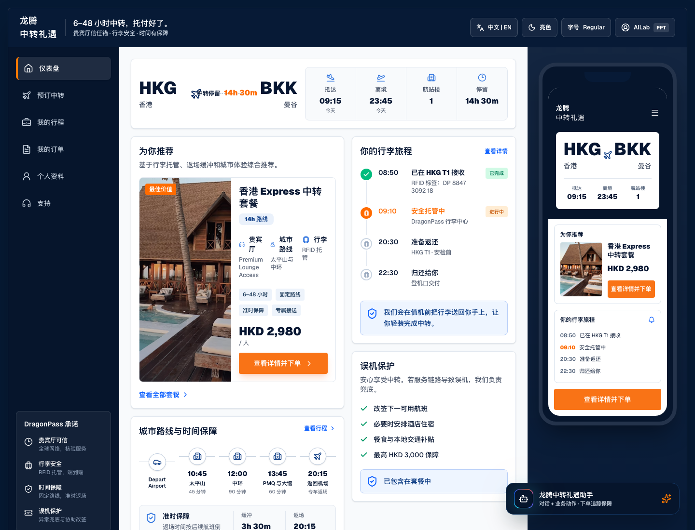
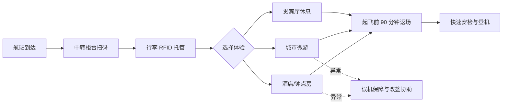
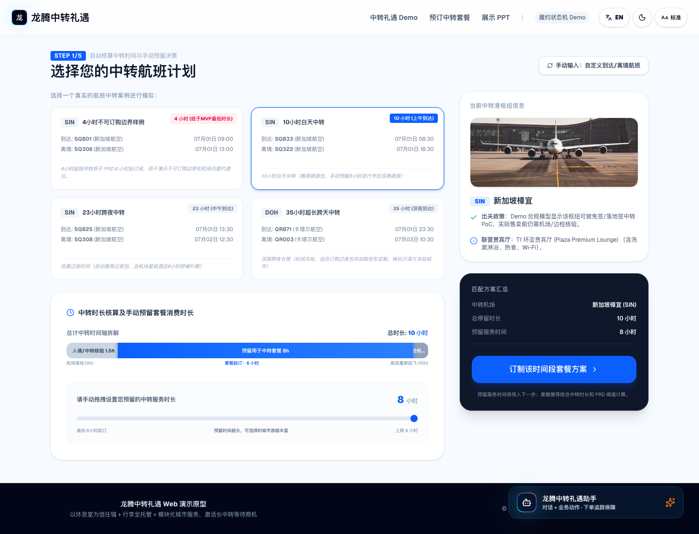
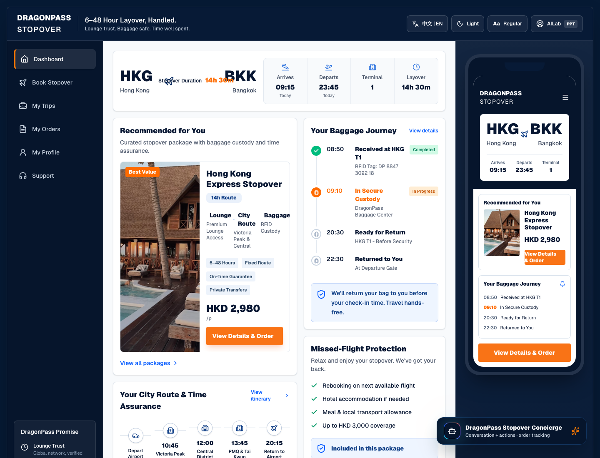
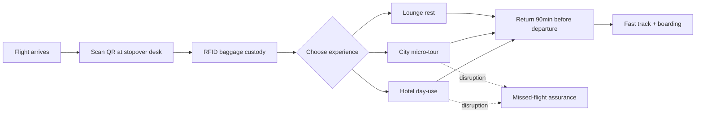
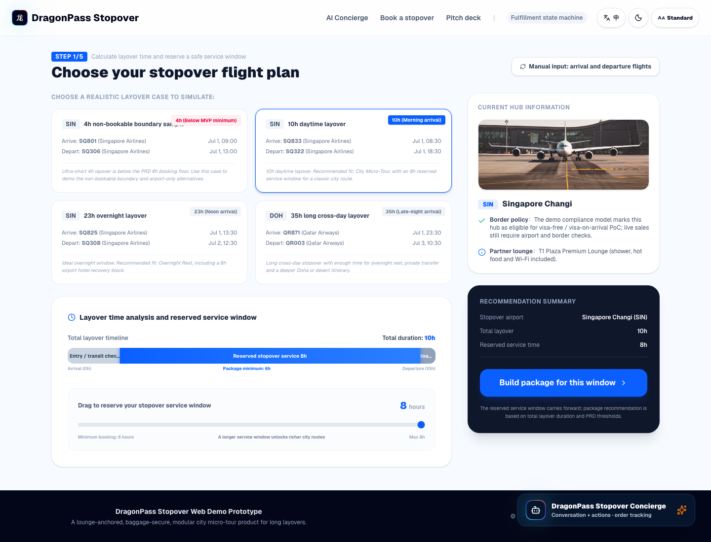

# 龙腾中转礼遇 Stopover

<a id="top"></a>

<div align="center">
  <h3>把 6-48 小时机场等待，升级为可托付、可探索、可保障的中转体验</h3>
  <p>
    以休息室为信任锚，串联行李全托管、城市微游、酒店休息和误机保障，让中转不再只是等待。
  </p>
  <p>
    <a href="#中文产品简报"></a>
    &nbsp;&nbsp;
    <a href="#english-product-brief"></a>
  </p>
  
</div>

---

## 中文产品简报

### 一句话概念

**龙腾中转礼遇** 是面向 6-48 小时中转旅客的机场生态服务包：用户在到达中转地后，把行李交给可信服务网络，自己可以选择进入贵宾厅、参加标准化城市微游，或入住合作酒店/钟点房；系统负责行李返场、时间缓冲和误机保障。

> 用户不是买一次观光，而是在买确定性：行李有人管、时间有人算、出机场有人带、误机有人兜底。

### 为什么现在需要它

| 现实问题 | 旅客感受 | 产品机会 |
| --- | --- | --- |
| 6-48 小时中转时间难安排 | 候机厅等待无聊，临时做攻略风险高 | 用标准化套餐降低决策成本 |
| 拖箱限制机场外活动 | 不想拖行李出机场，不敢轻装离开 | 用 RFID 行李托管释放行动自由 |
| 陌生城市怕踩坑、怕误机 | 语言、交通、路线、返场时间都不确定 | 用固定路线、双语向导和返场缓冲兜底 |
| 休息室只覆盖 2-3 小时 | 剩余长时间没有被有效服务化 | 从单点休息室升级为中转全链路套餐 |

### 产品闭环



### 三档核心套餐

| 套餐 | 推荐场景 | 核心权益 | 价格带 |
| --- | --- | --- | --- |
| **轻享包** | 6-8 小时，主要想休息和洗漱 | 贵宾厅 3h、行李寄存、快速安检、淋浴/Wi-Fi | ¥260-320 |
| **微游包** | 10-18 小时，白天想轻装看城市 | 行李全托管、城市 4-6h 固定路线、专车接送、双语向导、误机保障 | ¥680-880 |
| **过夜包** | 12-36 小时，跨夜或家庭中转 | 合作酒店/钟点房、行李直送、机场酒店接送、餐食与保障 | ¥780-1200 |

可选增值项：中转地 eSIM、专车升级、酒店续住、淋浴/睡眠舱、机场餐饮券、AI 团餐匹配、私人包车。

### Demo 展示了什么



| 演示节点 | 评审能看到什么 |
| --- | --- |
| AI 礼宾首页 | 用户用自然语言描述中转时长、行李和偏好，系统推荐可履约方案 |
| 航班计划页 | 系统区分总中转时长、服务时长和登机缓冲，4 小时边界不可订购 |
| 套餐页 | 轻享、微游、过夜三档套餐按 PRD 阈值推荐 |
| 电子凭证页 | 订单 QR、RFID 行李标签、旅客信息和服务触发点 |
| 履约追踪页 | 行李收件、保管、返场、签收，以及城市微游/酒店状态 |
| 异常分支 | 城市游或酒店环节误时后触发误机保障、赔付与改签协助 |

### 目标用户

| 用户 | 中转时长 | 关键需求 | 推荐方案 |
| --- | --- | --- | --- |
| 探索型商旅 / 高净值自由行 | 8-24h | 想看城市，但不想做攻略、不想拖箱、不想误机 | 微游包 + eSIM/包车 |
| 家庭中转旅客 | 12-36h | 孩子需要休息，行李多，想少折腾 | 过夜包 + 酒店/钟点房 |
| 红眼航班恢复型旅客 | 6-12h | 洗漱、补眠、吃饭、快速返场 | 轻享包 + 淋浴/餐饮券 |

### 差异化

| 维度 | 常见中转游 | 龙腾中转礼遇 |
| --- | --- | --- |
| 服务对象 | 常绑定单一航司或单一机场 | 面向任意符合条件的中转旅客 |
| 服务范围 | 机场内观光或单点城市游 | 机场内外全链路：休息室、行李、城市、酒店、返场 |
| 行李处理 | 多数不覆盖 | RFID 行李托管，离境前返场 |
| 风险处理 | 误时保障弱 | 返场缓冲、误机保障、改签协助 |
| 商业化 | 单点服务 | 三档套餐 + 模块化增值项 |

### 商业验证口径

| 指标 | PRD 目标 |
| --- | --- |
| 套餐渗透率 | 上市后 90 天达到 8% |
| 单中转客单价 | 从休息室单点约 ¥200 提升到 ¥450+ |
| 行李托管转化率 | 购买套餐用户中达到 30% |
| 用户 NPS | 上市后 90 天达到 50+ |
| 履约零事故率 | 漏接/误机赔付链路 100% 可追踪 |

### 适合现场讲述的 90 秒版本

1. 长中转用户真正焦虑的不是“去哪玩”，而是行李、时间和误机风险。
2. 龙腾已有休息室信任基础，可以把休息室从单点权益升级成中转服务入口。
3. 用户一次性购买轻享、微游或过夜套餐，行李由服务网络托管，旅客自由去休息、微游或入住。
4. 系统围绕航班时间做服务窗口、返场缓冲和行李追踪，异常时触发误机保障。
5. 这让中转服务从 ¥200 左右的休息室单点，升级为 ¥450+ 的机场生态套餐。

<div align="center">
  <a href="#top">回到顶部</a>
  ·
  <a href="#english-product-brief"></a>
</div>

---

## English Product Brief

### Concept

**DragonPass Stopover Concierge** is a product concept for 6-48h layover passengers. After arriving at the transit hub, travelers hand over baggage to a trusted service network, then choose lounge rest, a guided city micro-tour or a partner hotel/day-use room. The system coordinates baggage return, timing buffer and missed-flight assurance.

> Users are not buying sightseeing; they are buying certainty across baggage, timing, route guidance and disruption protection.



### The Product Loop



### Package System

| Package | Best For | Core Benefits | Price Band |
| --- | --- | --- | --- |
| **Light Rest** | 6-8h recovery layover | 3h lounge, baggage storage, fast track, shower/Wi-Fi | ¥260-320 |
| **City Micro-tour** | 10-18h daytime layover | RFID baggage custody, 4-6h city route, transfer, bilingual guide, assurance | ¥680-880 |
| **Overnight** | 12-36h overnight or family layover | Partner hotel/day-use room, baggage delivery, transfer, meals and assurance | ¥780-1200 |

### What The Demo Proves



| Demo Moment | What Judges See |
| --- | --- |
| AI concierge | Natural language input becomes a fulfillable stopover plan |
| Flight planning | Total layover, service window and boarding buffer are separated |
| Package recommendation | Packages follow PRD thresholds: 6-8h, 10-18h, 12-36h |
| QR voucher | One order carries passenger, flight, package, add-ons and baggage tag |
| Journey tracking | Baggage states are visible from handoff to return |
| Assurance branch | Delay scenario triggers protection, compensation and rebooking support |

### Why It Matters

| Current Market Gap | Stopover Concierge Advantage |
| --- | --- |
| Most stopover tours bind to one airline or one airport | Open to eligible transit passengers across hubs |
| Lounge access solves only 2-3 hours | Converts the whole layover into a serviceable journey |
| Baggage blocks city exploration | RFID custody removes the largest behavior barrier |
| Missed-flight risk suppresses conversion | Fixed routes, return buffers and assurance reduce decision anxiety |
| Single-product monetization | Three packages plus modular add-ons increase ARPL potential |

<div align="center">
  <a href="#top">Back to top</a>
  ·
  <a href="#中文产品简报"></a>
</div>

---

## 附录：Demo 运行与实现说明

<details>
<summary>展开本地运行、AI 配置和技术栈</summary>

### 本地运行

```bash
npm install
npm run dev
```

打开：

```text
http://localhost:3000
```

常用命令：

```bash
npm run dev      # 启动开发服务器
npm run build    # 生产构建与 TypeScript 校验
npm run start    # 启动生产构建产物
npm run lint     # ESLint
```

### AI 礼宾配置

`/api/concierge` 默认使用 DashScope OpenAI-compatible endpoint。未配置 Key、接口失败或超时时，会返回本地规则引擎结果，保证现场 demo 不会中断。

```bash
DASHSCOPE_API_KEY=...
COMPATIBLE_API_KEY=... # 可作为 DASHSCOPE_API_KEY 的替代
COMPATIBLE_BASE_URL=https://dashscope.aliyuncs.com/compatible-mode/v1
DEFAULT_MODEL=qwen3.7-max
MODEL_TEMPERATURE=0.2
LLM_CALL_TIMEOUT=10
```

使用现有 smartbundlex 百炼配置：

```bash
set -a
source /Users/kaisun/smartbundlex/.env.dev
set +a
npm run dev -- -p 3000
```

### 当前技术实现

| 层级 | 当前实现 |
| --- | --- |
| 应用框架 | Next.js 16.2.9，App Router |
| UI 运行时 | React 19.2.4 |
| 语言 | TypeScript 5 |
| 样式 | Tailwind CSS v4 |
| 状态 | Zustand 5 + `persist` |
| 时间 | Day.js |
| 动效 | Framer Motion |
| 图表 | Recharts |
| QR 码 | qrcode.react |
| AI 礼宾 | Next.js Route Handler + DashScope OpenAI-compatible API |

### 当前限制

- 不接真实支付、航班动态、行李 IoT/RFID、酒店 PMS、eSIM、餐饮或城市游供应商库存。
- 不做用户登录、B2B 分销、签证/入境服务或后台运营系统。
- 这是 C 端体验和履约逻辑 demo，不是生产级订单中台。
- 当前版本包含 `/api/concierge` 服务端接口，不建议直接做纯静态导出。

</details>
